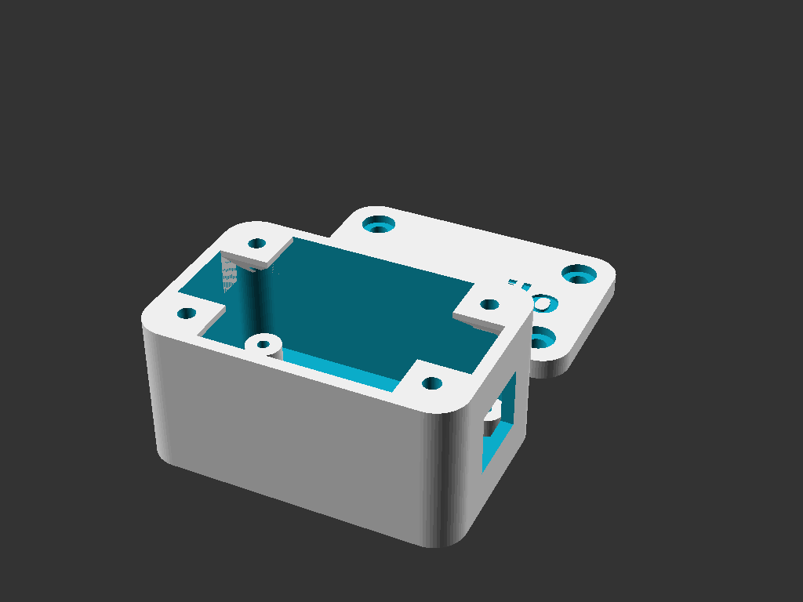
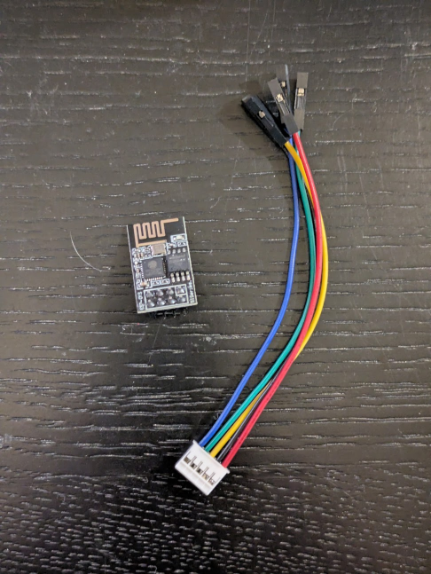
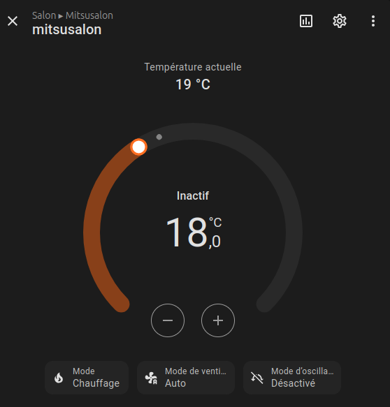
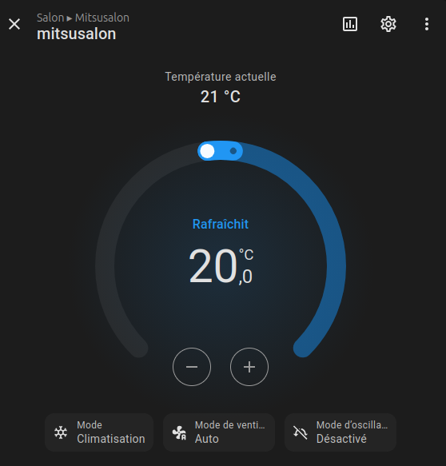

# maxmilo - Contrôleur ESPHome pour Climatiseurs Mitsubishi

Ce projet vous permet de contrôler votre unité CVC Mitsubishi (avec un port CN105) en utilisant un ESP8266 (ESP-01) et ESPHome. Il est basé sur l'excellent travail de [echavet/MitsubishiCN105ESPHome](https://github.com/echavet/MitsubishiCN105ESPHome).

Il offre une interface moderne via Home Assistant ou un navigateur web, et dispose d'un portail captif pour une configuration WiFi facile.

[🇬🇧 Read the English version here](README_EN.md)

<p align="center">
  
</p>

<p align="center">
  
  
  
</p>

## 🚀 Fonctionnalités

- **Installation en un clic :** Via l'installateur web, sans ligne de commande.
- **Portail Captif WiFi :** Connectez-vous au point d'accès du module pour configurer votre réseau local.
- **Renommage dynamique :** Changez le nom de votre unité directement depuis l'interface web.
- **Intégration Home Assistant :** Découverte automatique via l'API Native.
- **Matériel Open Source :** Boîtier imprimable en 3D avec fixations sécurisées.

## 🛠 Matériel Requis

Pour fabriquer ce contrôleur, vous aurez besoin de :

1.  **Module ESP8266 ESP-01**
2.  **Adaptateur Série WiFi ESP-01** (Assure la régulation 5V vers 3.3V et l'adaptation de niveau logique)
3.  **Connecteur JST PAP-05V-S** (Connecteur 5 broches pour le port CN105)
4.  **Boîtier maxmilo** (Fichier SCAD fourni dans `hardware/`)

### Schéma de câblage (CN105 vers ESP-01)

| Broche CN105 | Fonction | Adaptateur ESP-01 |
| :--- | :--- | :--- |
| 1 | 12V | Non Connecté |
| 2 | GND | GND |
| 3 | 5V | VCC (5V) |
| 4 | TX | RX (GPIO3) |
| 5 | RX | TX (GPIO1) |

> ⚠️ **Attention :** Assurez-vous que votre adaptateur gère bien la conversion de niveau 5V vers 3.3V pour protéger l'ESP-01.

## 💻 Installation

### Option A : Installateur Web (Recommandé)
Flashez votre ESP-01 directement depuis votre navigateur (Chrome/Edge) sans rien installer !
👉 **[Cliquez ici pour utiliser l'Installateur Web maxmilo](https://zefr0g.github.io/maxmilo/web_installer/)**

### Option B : Installation Manuelle (CLI)
Si vous préférez compiler vous-même :

#### 1. Installer ESPHome
```bash
pip install esphome
```

#### 2. Flasher le Firmware
```bash
esphome run example.yaml
```

## 💰 Acheter un Kit
Vous ne voulez pas sourcer les pièces vous-même ? [Ouvrez une Issue sur GitHub](https://github.com/zefr0g/maxmilo/issues) pour commander un kit prêt à l'emploi.

## 🤝 Contribution
Les contributions sont les bienvenues ! N'hésitez pas à ouvrir une issue ou une pull request.
